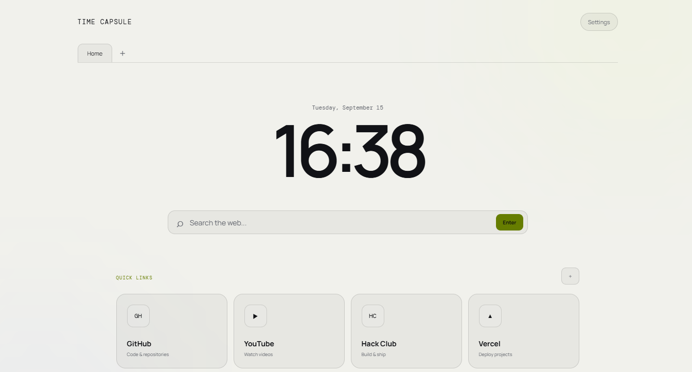

# Time Capsule

Time Capsule is a custom new-tab workspace built around the idea of keeping your important things in one place while also letting you save messages for the future.

It combines a personal dashboard, productivity tools, and a small simulated browser into one interface.

## Features

- Live clock and date
- Custom search
- Quick links
- Productivity checklist
- Time capsules with unlock dates
- LocalStorage persistence
- Custom quick links
- Theme settings
- Browser-style tabs
- New tab button
- Internal browser pages
- Simulated pages for GitHub, YouTube, Hack Club, and Vercel
- Simulated search results
- Responsive layout

## Time Capsules

The main feature is the time capsule system.

You can create a capsule with:

- A title
- A message
- An unlock date and time

Locked capsules stay unavailable until their unlock time.

Once unlocked, the message can be opened from the dashboard.

Capsules are stored locally using `localStorage`, so they remain available after refreshing the page.

## Simulated Browser

Time Capsule also includes a small browser-style environment.

The quick links do not simply send you away from the project. Instead, they open internal tabs containing simplified preview pages.

The browser simulation includes:

- GitHub preview
- YouTube preview
- Hack Club preview
- Vercel preview
- Fake search results
- Multiple tabs
- Tab switching
- New tabs
- Returning to the homepage

The pages are intentionally simplified simulations rather than copies of the real websites.

## Technologies

- HTML
- CSS
- JavaScript
- LocalStorage

No framework or backend is required.

## Design

I wanted Time Capsule to feel more like a personal desktop/browser environment than a normal productivity dashboard.

The interface uses:

- Dark UI
- Large typography
- Monospace elements
- Browser-style tabs
- Minimal cards
- Subtle animations
- Responsive layouts

## What I Learned

While building Time Capsule, I worked with:

- LocalStorage
- Dynamic DOM rendering
- Modals
- Browser-style tab systems
- State management in JavaScript
- Dynamic search results
- Responsive CSS
- Building multiple UI states inside one page

One of the more interesting parts was figuring out how to make the quick links feel like they were opening websites without actually embedding or copying the real websites.

## Project

Built for Hack Club Stardance.

[Live Demo](https://time-capsule-4z5.pages.dev/)